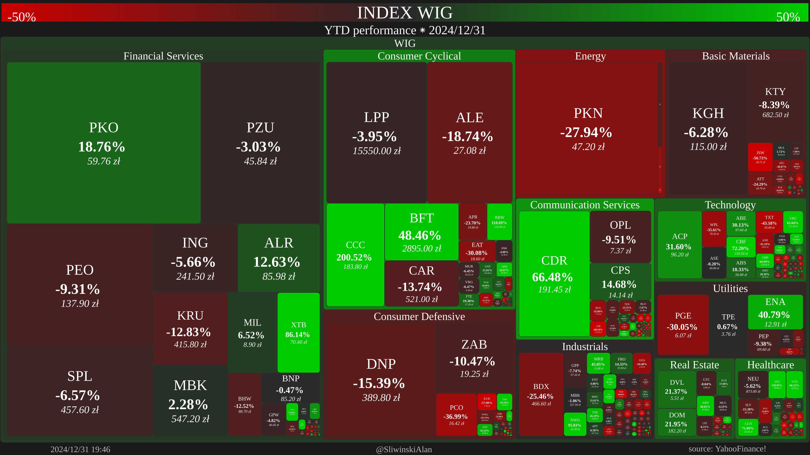
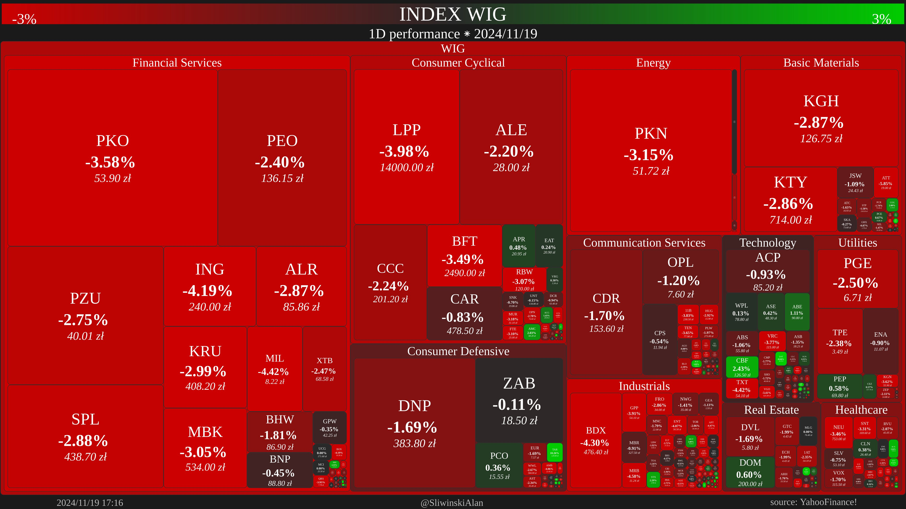

# Twitter Bot for WIG Heatmaps

This project is a Twitter bot that automatically posts heatmaps of the WIG (Warsaw Stock Exchange Index) performance. The bot generates heatmaps using financial data and tweets them at specified intervals.



## Features

- **Daily Heatmaps**: Posts daily performance heatmaps.
- **Weekly Heatmaps**: Posts weekly performance heatmaps.
- **Monthly Heatmaps**: Posts monthly performance heatmaps.
- **Quarterly Heatmaps**: Posts quarterly performance heatmaps.
- **Yearly Heatmaps**: Posts yearly performance heatmaps.
- **YTD Heatmaps**: Posts year-to-date performance heatmaps on random days.
  


## Dependencies

The project requires Python 3.11 or higher. The dependencies are managed using [`pyproject.toml`](pyproject.toml):

## Installation

This project uses `uv` for dependency management. To install the project dependencies using `uv`, run:

  ```sh
  uv sync
  ```

This will install all the dependencies specified in the pyproject.toml file.

## Configuration

1. Create a keys.py file with your Twitter API credentials:

   ```python
      consumer_key = "your_consumer_key"
      consumer_secret = "your_consumer_secret"
      access_token = "your_access_token"
      access_token_secret = "your_access_token_secret"
   ```

2. Ensure the wig_comps.csv file is present in the project directory. This file should contain the WIG components data.

## Usage

Run the bot using the following command:

```sh
uv run main.py
```

The bot will authenticate with Twitter, download the necessary financial data, generate heatmaps, and post them according to the schedule.

## Logging

The bot logs its activities to app.log. You can check this file for detailed logs of the bot's operations.
