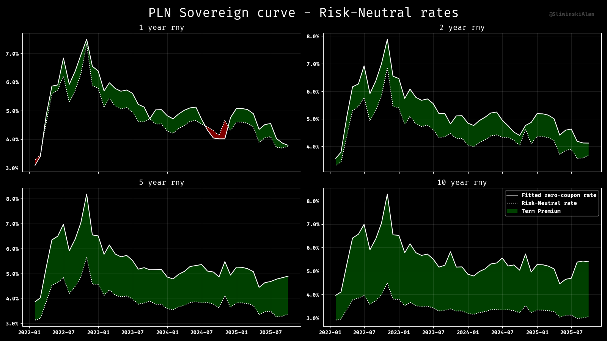

# 📈 Pricing: Polish Term Structure

Overview
--------

This package provides tools to estimate risk‑neutral rates and term premia for Polish government bonds and to partially reproduce the methodology behind the "Adrian, Crump & Moench 10‑Year Treasury Term Premium" (ACMTP10 Index). It builds zero‑coupon curves from market bond prices and fits the Nelson‑Siegel‑Svensson (NSS) model to extract term structure features.

Key features ✨

- Build zero‑coupon curves using QuantLib
- Extract zero rates for specified horizons
- Fit NSS model to observed zero rates
- Export results and curves to Parquet
- Compute risk‑neutral rate and term premium
- Basic visualization helpers



Quick start 🚀
-------------

The project uses `uv` to manage and run package tasks. To run this package locally:

```shell
uv run ./packages/pricing_term_structure
```
